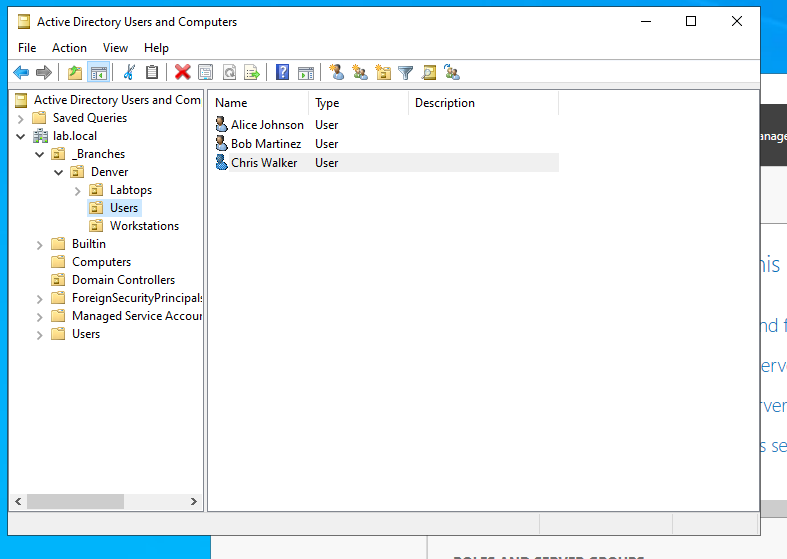
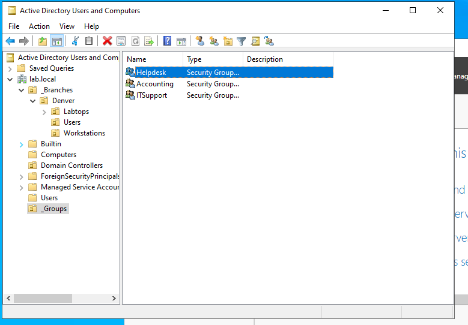
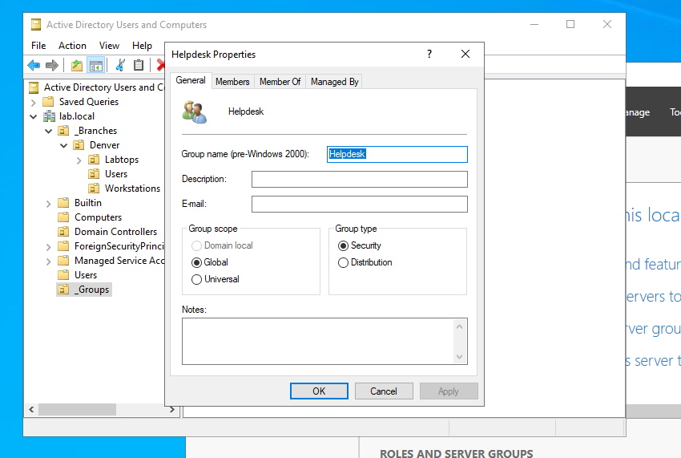
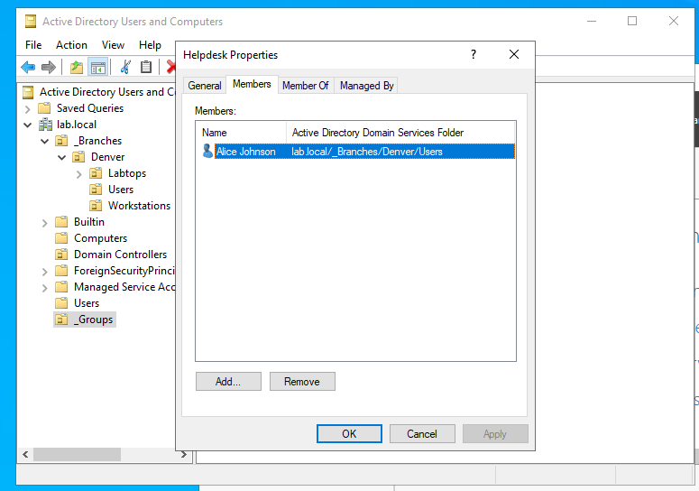
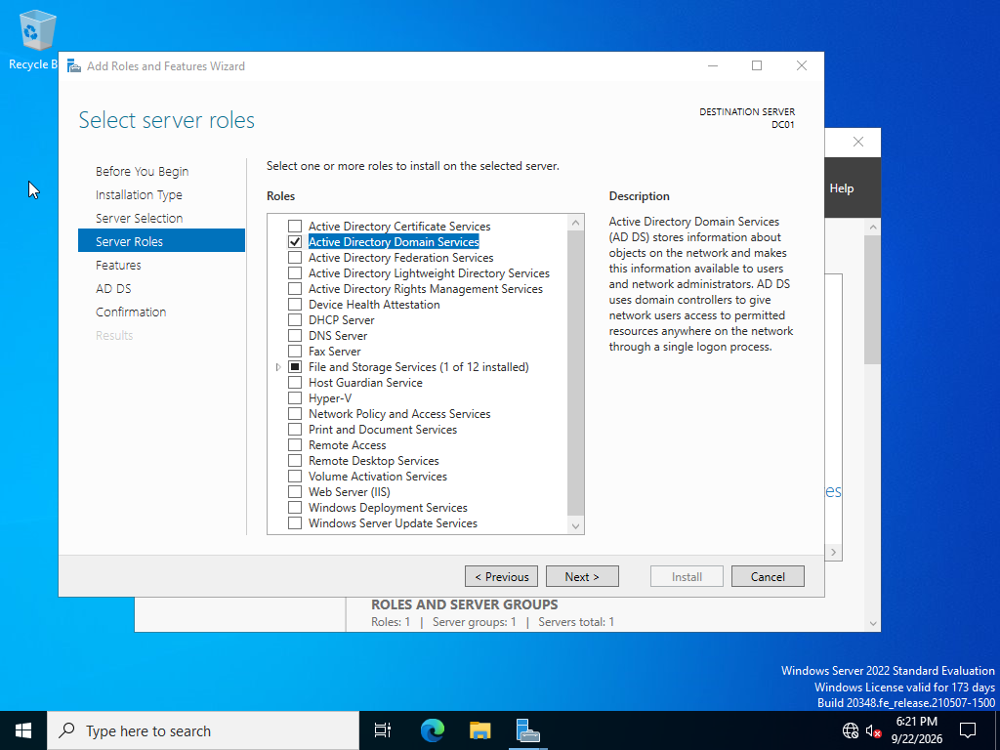
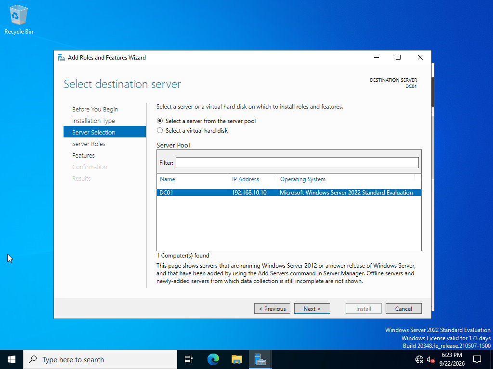
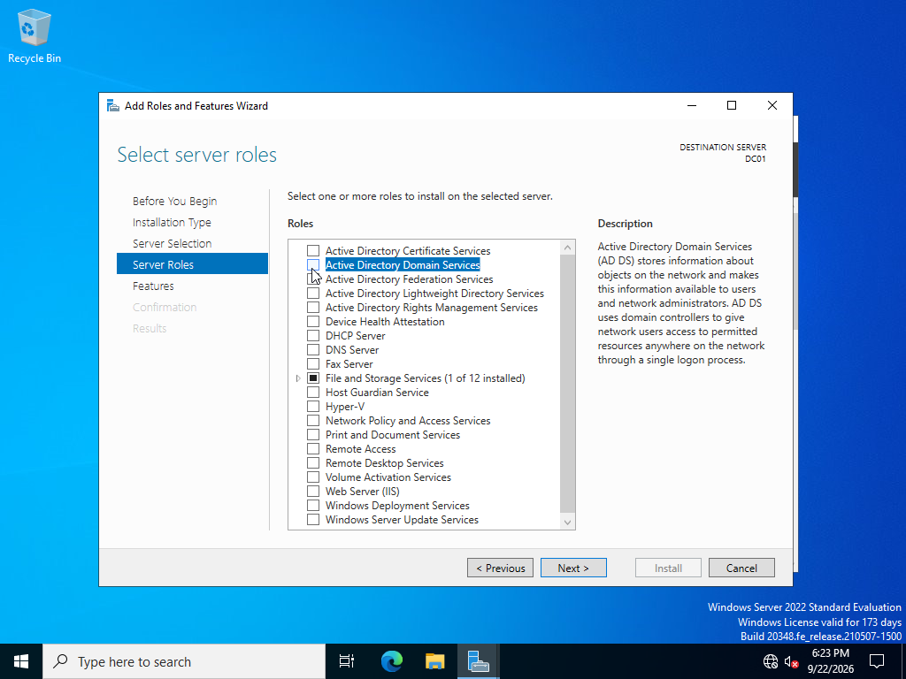
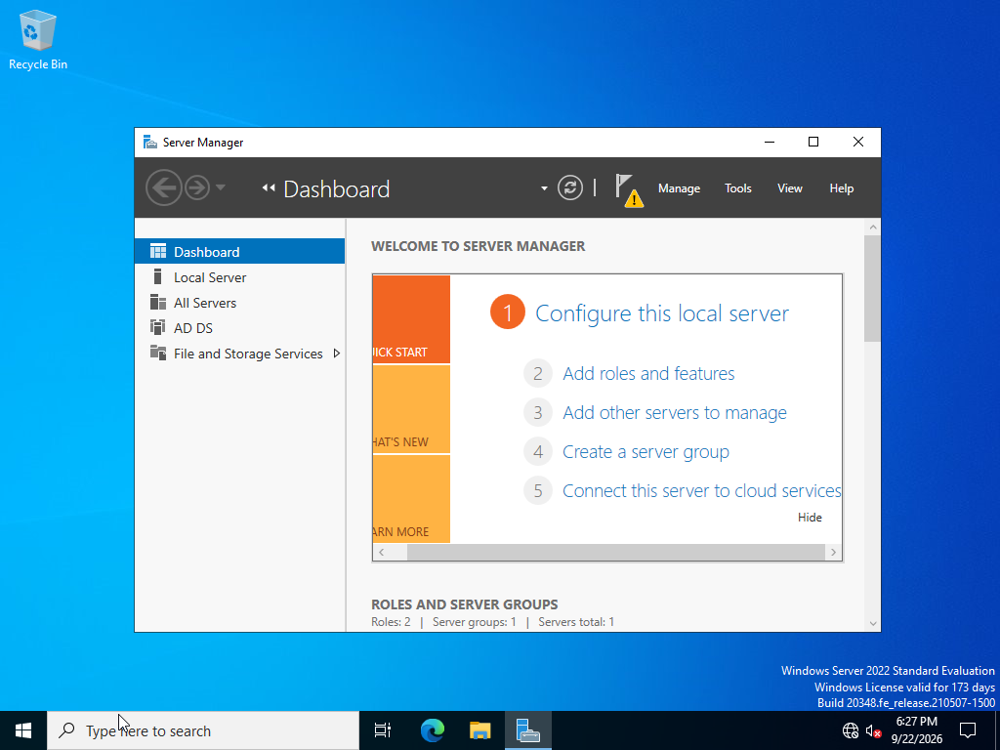
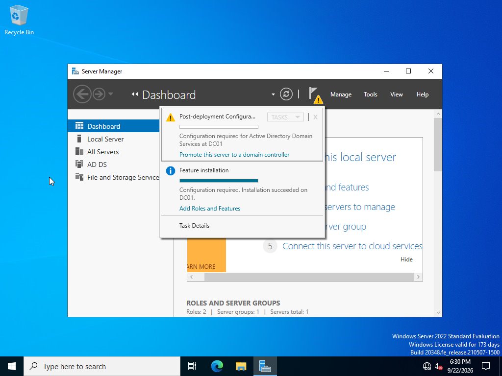
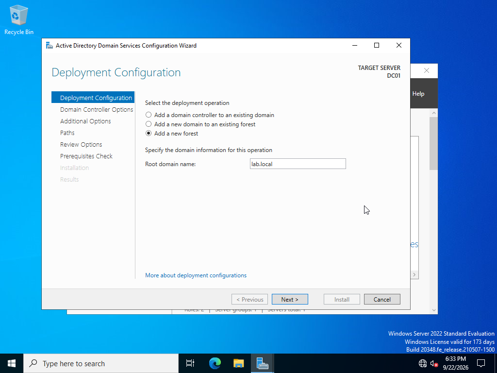

# Active Directory Domain Services Homelab

## Overview

This project documents the setup of a basic **Active Directory Domain Services (AD DS)** environment using **Windows Server 2022** running as a virtual machine in **Oracle VirtualBox**.

The purpose of this lab is to build hands-on experience with Windows Server administration and Active Directory. This stage covers installing the AD DS server role and beginning the promotion of the server to the first domain controller in a new Active Directory forest.

> **Lab status:** The `lab.local` domain is available, and three Denver user accounts have been created and verified in ADUC and PowerShell. A centralized `_Groups` OU contains Helpdesk, Accounting, and ITSupport. Helpdesk is verified as Global Security, with Alice Johnson as a member. Accounting and ITSupport are visible as security groups; their Global scope remains to be verified. Resource permissions have not been demonstrated. The deployment screenshots below document the earlier setup stage; the health checks listed below remain a verification plan.

## User Administration Lab

[Create and verify three Active Directory users](user-creation/README.md) — Windows Server 2022 user creation in `_Branches > Denver > Users`, with five screenshots and PowerShell verification.

## Security Groups and Membership

Building on the [user-creation lab](user-creation/README.md), I organized role groups centrally and added Alice Johnson to Helpdesk using **Active Directory Users and Computers (ADUC)**. This exercise demonstrates directory organization, group configuration, and membership administration as a foundation for group-based access.

### Directory Design and Current Results

User accounts remain under `lab.local/_Branches/Denver/Users`. The centralized `_Groups` OU sits directly under `lab.local`, alongside `_Branches`, so role groups can be managed separately from branch user accounts.

```text
lab.local
├── _Branches
│   └── Denver
│       └── Users
│           ├── Alice Johnson
│           ├── Bob Martinez
│           └── Chris Walker
└── _Groups
    ├── Helpdesk       [created; Alice Johnson is a member]
    ├── Accounting     [created; scope not yet verified]
    └── ITSupport      [created; scope not yet verified]
```

*Relevant portion of the verified directory structure. The design calls for Global Security groups; only Helpdesk has a properties screenshot confirming scope.*

| Item | Configuration or result | Status |
|---|---|---|
| Centralized group OU | `OU=_Groups,DC=lab,DC=local` | Created; visible at the domain root |
| Helpdesk | Global scope, Security type | Created and verified in group properties |
| Alice Johnson | Member of Helpdesk; account remains in Denver Users | Verified in Helpdesk's Members tab |
| Accounting and ITSupport | Security groups in `_Groups`; Global scope intended | Creation verified; scope not shown in the list view |
| Resource access | Assign permissions to a group and test member access | Future work |

### Selected Evidence



*Denver user accounts — The existing user-creation result establishes the three accounts in `_Branches/Denver/Users` before the security-group exercise.*



*All three groups created — The root-level `_Groups` OU contains Helpdesk, Accounting, and ITSupport. The Type column identifies them as security groups; this view does not establish their scope.*



*Centralized group management — Helpdesk's General tab confirms Global scope and Security type. The directory tree also shows `_Groups` directly beneath `lab.local`.*



*Membership verified — Alice Johnson appears in Helpdesk's Members tab, with her account location still shown as `lab.local/_Branches/Denver/Users`.*

### OU vs. Security Group

An **organizational unit (OU)** organizes directory objects and provides a place to delegate administration and link Group Policy. Placing Alice in the Denver Users OU does not automatically make her a member of Helpdesk or grant access to a shared folder.

A **security group** collects security principals, such as user accounts, so rights and resource permissions can be assigned to the group. Alice can remain in her branch OU while belonging to a role group stored in `_Groups`.

**Global scope** fits a role group whose members come from the same domain: it can contain accounts and other Global groups from `lab.local`. Global does not mean unrestricted access. **Security type** makes the group usable for permissions; a Distribution group is intended for email distribution and cannot be used in resource access-control lists. See [Microsoft's security-group reference](https://learn.microsoft.com/en-us/windows-server/identity/ad-ds/manage/understand-security-groups).

### Account → Group → Permission

```text
Verified:  Alice Johnson → member of Helpdesk
Future:    Helpdesk → permission on a resource → test Alice's effective access
```

The completed work establishes the **account → group** relationship. Creating Helpdesk and adding Alice does not by itself grant new resource access. The next stage is to assign a defined resource permission through a group and test the result. Managing access through groups makes role changes easier to review than maintaining separate permissions for every user.

No resource ACL changes, group nesting, or successful access tests are claimed here. Bob and Chris's Helpdesk membership is also not demonstrated.

**Skills demonstrated:** OU organization, Global Security group configuration, ADUC membership administration, and verification of account-to-group relationships.

## Lab Environment

| Component | Configuration |
|---|---|
| Hypervisor | Oracle VirtualBox |
| Server OS | Windows Server 2022 Standard Evaluation |
| Server Name | `DC01` |
| Server IP | `192.168.10.10` |
| Server Role | Active Directory Domain Services |
| Forest / Domain | `lab.local` |
| DNS | DNS Server installed/configured as part of domain controller promotion |

## Objectives

- Deploy a Windows Server 2022 virtual machine in VirtualBox.
- Configure the server as `DC01` with a static IP address.
- Install the Active Directory Domain Services role.
- Promote `DC01` to a domain controller.
- Create a new Active Directory forest named `lab.local`.
- Configure the Directory Services Restore Mode (DSRM) password.
- Build a foundation for later labs involving DNS, DHCP, users, groups, organizational units, permissions, Group Policy, and Windows client domain joins.

## 1. Open Server Manager

I began in **Server Manager** on the Windows Server 2022 VM. The server had already been named `DC01` and configured with the lab network settings.



From Server Manager, I selected **Add roles and features** to begin installing Active Directory Domain Services.

## 2. Select the Destination Server

I selected `DC01` from the server pool as the destination server. Server Manager showed the server using IP address `192.168.10.10` and Windows Server 2022 Standard Evaluation.



## 3. Select Active Directory Domain Services

Under **Server Roles**, I selected **Active Directory Domain Services**. AD DS stores information about domain users, computers, groups, and other network objects and provides centralized authentication and administration.



## 4. Complete the AD DS Role Installation

After installation, **AD DS** appeared in Server Manager.



Installing the role does **not** automatically make the server a domain controller. Server Manager displayed a post-deployment notification indicating that additional configuration was required.

## 5. Begin Domain Controller Promotion

From the Server Manager notification flag, I selected **Promote this server to a domain controller**.



## 6. Create a New Forest

Because this is a brand-new Active Directory environment, I selected **Add a new forest** and entered:

```text
lab.local
```



For this homelab, `lab.local` provides a simple private namespace for practicing Active Directory administration.

## Domain Controller Options

The next stage uses the following lab configuration:

- **Forest functional level:** Default supported level
- **Domain functional level:** Default supported level
- **DNS Server:** Enabled
- **Global Catalog (GC):** Enabled
- **Directory Services Restore Mode (DSRM):** Password configured and stored securely

The actual DSRM password is intentionally **not documented in this public repository**.

## Verification Plan

After promotion and reboot, I will verify the deployment with:

```powershell
ipconfig /all
nslookup lab.local
Get-ADDomain
Get-ADForest
```

I will also confirm that **Active Directory Users and Computers** and **DNS Manager** open successfully and that the expected `lab.local` domain structure is present.

## What I Learned

- Installing AD DS does not by itself make a Windows Server a domain controller.
- The server must be promoted after the AD DS role and management tools are installed.
- The first domain controller creates a new **forest** and **domain**.
- DNS is tightly integrated with Active Directory.
- Domain controllers should use predictable network configuration, including a static IP address.
- Recovery credentials such as the DSRM password should not be stored in public documentation.

## Next Steps

- Document the remaining domain controller promotion steps.
- Verify Active Directory and DNS health.
- Extend documentation of the OU structure beyond the Denver users and centralized groups shown above.
- Verify Global scope for Accounting and ITSupport in their group properties.
- Extend group membership as required, assign resource permissions through groups, and test effective access.
- Install and configure DHCP.
- Join Windows 10/11 client VMs to the domain.
- Create and test Group Policy Objects (GPOs).
- Practice common Active Directory troubleshooting scenarios.

## Skills Demonstrated

`Windows Server 2022` · `Active Directory Domain Services` · `DNS` · `VirtualBox` · `Windows Administration` · `Domain Controllers` · `PowerShell` · `Technical Documentation`

---

### Project Note

This repository documents a personal homelab used for learning and skills development. It is not intended to represent a production enterprise deployment.
