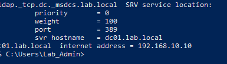
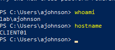
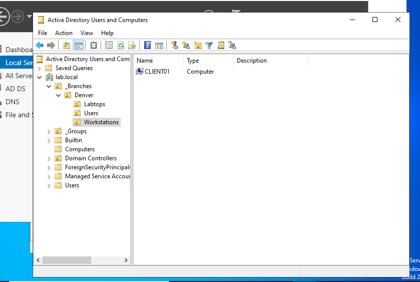
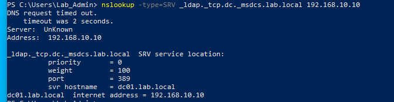
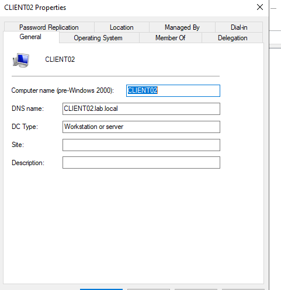

# Part 4: Client Domain Joins and Troubleshooting

[Previous: Part 3 — Security Groups](../security-groups/README.md) · [Lab overview](../README.md)

## Overview

I extended the `lab.local` environment by joining CLIENT01 and CLIENT02 to Active Directory. I completed CLIENT01 with guidance, then repeated the exercise independently on CLIENT02, troubleshooting a DNS address typo and locating a computer account moved into the wrong container.

The exercise connects the earlier server, user, and group work: a client discovers DC01 through DNS, joins the domain using authorized credentials, and allows a domain user to sign in.

## Environment and Evidence

| Component | Configuration or verified result |
|---|---|
| Domain controller / DNS | `DC01`, `192.168.10.10` |
| Domain | `lab.local` |
| CLIENT01 | Windows 10 Pro 22H2; `192.168.10.11/24` |
| CLIENT02 | Windows client; `192.168.10.12/24` |
| Client DNS | Intended address `192.168.10.10`; CLIENT02 required correction |
| Virtual networking | VirtualBox lab using Internal Network; clients require the same network name as DC01 |
| User sign-in | `LAB\ajohnson` verified on CLIENT01 |
| Target computer OU | `lab.local/_Branches/Denver/Workstations` |

CLIENT01's domain sign-in and final OU placement are screenshot-verified. CLIENT02's join was reported successful and its AD computer properties were captured. I later located CLIENT02 in the wrong container; its final placement in Workstations and a domain-user sign-in on CLIENT02 are not shown in the available evidence.

## Prepare the Clients

I assigned distinct Windows computer names, CLIENT01 and CLIENT02, and checked the client network configuration. In Windows' IP settings, **subnet prefix length** requires `24`, rather than the equivalent mask `255.255.255.0` displayed by `ipconfig`.

The client screenshots show static addresses on the same subnet and different MAC addresses. They also show DC01 entered as the default gateway. DC01's DNS role does not make it a router: an isolated internal network can leave the gateway blank, or use an actual lab router when one is configured. A gateway correction is not evidenced here; same-subnet traffic to DC01 does not require one.

Windows 10 Pro was confirmed on CLIENT01 before joining. Local setup accounts remain separate from AD users. Unique Windows computer names identify the machines in AD; the same local account name can exist independently on multiple clients.

## Discover the Domain and Join CLIENT01

I checked the adapter configuration and queried the domain-controller service record:

```powershell
ipconfig /all
nslookup -type=SRV _ldap._tcp.dc._msdcs.lab.local
```



*Domain discovery — DNS returned `dc01.lab.local`, address `192.168.10.10`, and LDAP port `389`. This confirms discovery, rather than proving every service required for a domain join is reachable.*

Through System Properties (`sysdm.cpl`), I selected Domain, entered `lab.local`, and completed the join using authorized domain credentials. Windows requested a restart to apply the membership change.

When I could not recall Alice's password, I followed the ADUC password-reset workflow on DC01 and then reported a successful sign-in. The subsequent command output verifies Alice's identity; password values and the reset dialog were not captured.

```powershell
whoami
hostname
```



*Domain sign-in verified — `whoami` returned `lab\ajohnson` and `hostname` returned `CLIENT01`, confirming the domain account and the client used for the session.*

## Organize the Computer Account

On DC01, CLIENT01 initially appeared in ADUC's default Computers container. I moved it to `_Branches/Denver/Workstations` and verified the result.



*Final placement — CLIENT01 is visible as a Computer object in the Denver Workstations OU.*

Alice's user account remains in Denver Users; the computer account belongs in Workstations. Moving the computer organizes it for administration and future OU-linked computer Group Policy. It does not rename the machine or replace its domain membership. No GPO configuration or application test was completed in this exercise.

## CLIENT02: Diagnose a DNS Timeout

While repeating the join on CLIENT02, I encountered a domain-controller discovery timeout. The investigation separated basic network reachability from DNS configuration:

| Observation | What it established |
|---|---|
| `ipconfig /all` screenshot showed `192.168.10.12/24` and DNS `192.168.10.10` | The earlier adapter capture appeared correct; later error evidence had to be checked separately |
| Ping to `192.168.10.10` returned four replies, with no packet loss | The address was reachable; this did not prove DNS was working |
| An explicit DNS query returned DC01's SRV record | The specified DNS server could answer that query |
| Domain join still failed with `0x000005B4 ERROR_TIMEOUT` | Windows' domain discovery was still timing out |
| Expanded join error listed DNS server **`192.196.10.10`** | The DNS address used for that join attempt contained a typo |

The explicit query was:

```powershell
nslookup -type=SRV _ldap._tcp.dc._msdcs.lab.local 192.168.10.10
```



*Useful but limited success — The query explicitly targeted the correct DNS address and returned the SRV record. An initial timeout remains visible; its cause was not established.*

The key difference was **`192.196.10.10` versus `192.168.10.10`**. Supplying a server at the end of `nslookup` overrides the configured DNS destination for that query, explaining why this test could succeed while the join failed. After correcting the DNS setting, I reported that the join worked. The earlier correct adapter screenshot and later incorrect join error represent different observations; the exact point when the setting changed was not recorded.

## CLIENT02: Locate a Misplaced Computer Account

After attempting to move CLIENT02 into the branch Workstations OU, it disappeared from the original view. A domain-wide search located its computer account, and I confirmed it was in the wrong container.



*Account located — The properties show CLIENT02 and `CLIENT02.lab.local`. This General tab confirms the object exists but does not establish its OU path.*

The troubleshooting lesson was to search before recreating an account or rejoining the computer. ADUC's Object tab, available with Advanced Features enabled, can identify the canonical path. The intended destination remains `_Branches/Denver/Workstations`; a final screenshot of CLIENT02 there is still needed.

## Results and Follow-Up

- **Completed:** CLIENT01 domain join, Alice's domain sign-in, and CLIENT01 placement in Denver Workstations.
- **Completed with evidence limits:** CLIENT02 join reported successful, its computer account located in AD, and the incorrect destination identified.
- **Still to capture:** CLIENT02 in the intended OU and `whoami`/`hostname` showing a domain-user session on CLIENT02.
- **Future work:** Group Policy and resource permission testing.

Cloning and Sysprep were discussed as preparation options, but execution was not demonstrated and is not claimed here.

**Skills demonstrated:** Client IP and DNS configuration, SRV lookups, domain joining, domain-user sign-in verification, computer-object administration, and evidence-based troubleshooting.

---

[Previous: Part 3 — Security Groups](../security-groups/README.md) · [Lab overview](../README.md)
