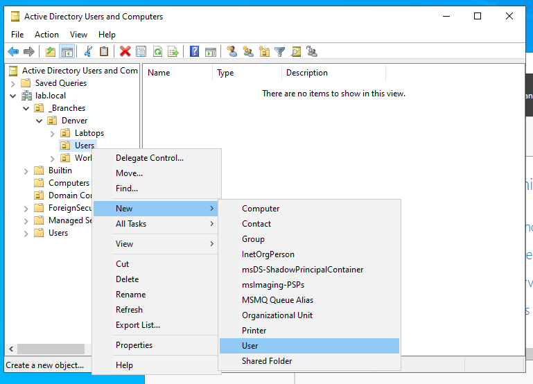
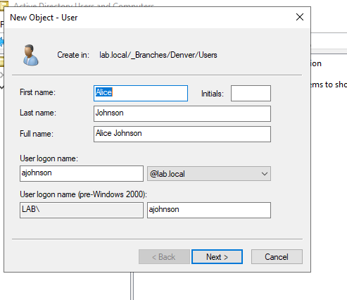
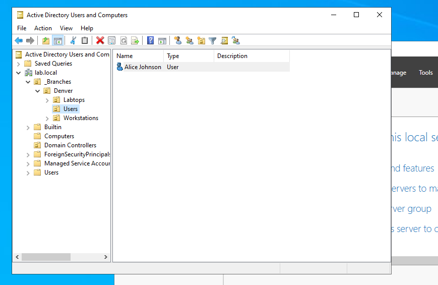
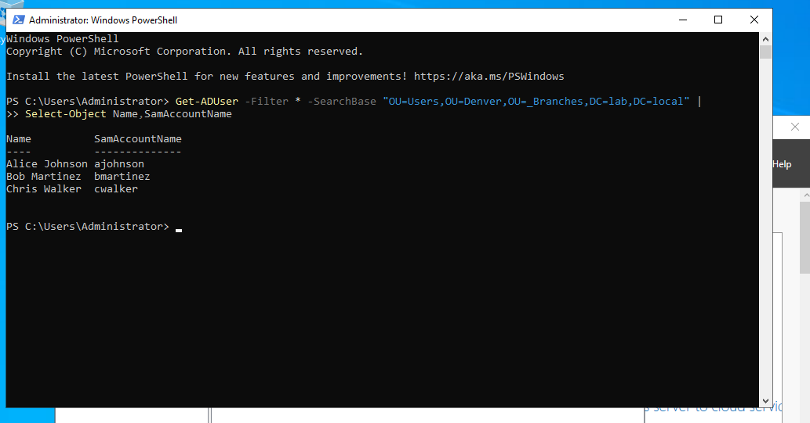

# Active Directory User Creation Lab

## Overview

In this lab, I created three domain user accounts in **Active Directory Users and Computers (ADUC)** on **Windows Server 2022**, then verified the results with **PowerShell**. The server ran in **Oracle VirtualBox** in my personal homelab.

The objective was to practice creating users in the correct organizational unit (OU) and checking the results through both the graphical interface and a targeted directory query.

> **Lab status:** All three users were created in the Denver Users OU and verified in ADUC and PowerShell. This exercise documents personal lab practice, not production administration.

[Back to the Active Directory lab](../README.md)

## Lab Environment

| Component | Configuration |
|---|---|
| Hypervisor | Oracle VirtualBox |
| Server OS | Windows Server 2022 |
| Domain | `lab.local` |
| Management tools | Active Directory Users and Computers; Windows PowerShell |
| Target OU | `_Branches > Denver > Users` |
| OU distinguished name | `OU=Users,OU=Denver,OU=_Branches,DC=lab,DC=local` |

The domain and OU structure were already available when this exercise began.

## Accounts Created

| Name | Username (`SamAccountName`) |
|---|---|
| Alice Johnson | `ajohnson` |
| Bob Martinez | `bmartinez` |
| Chris Walker | `cwalker` |

## 1. Navigate to the Denver Users OU

I opened **Active Directory Users and Computers**, expanded `lab.local`, and navigated to **_Branches > Denver > Users**. I right-clicked the **Users** OU and selected **New > User**.



*Figure 1: Starting the user-creation wizard from the Denver Users OU.*

## 2. Create Alice Johnson

In the **New Object – User** wizard, I entered:

| Field | Value |
|---|---|
| First name | Alice |
| Last name | Johnson |
| Full name | Alice Johnson |
| User logon name | `ajohnson` |
| UPN suffix | `@lab.local` |
| Pre-Windows 2000 logon name | `LAB\ajohnson` |



*Figure 2: Entering Alice's name and logon details in `lab.local/_Branches/Denver/Users`.*

I completed the wizard and confirmed that **Alice Johnson** appeared in the selected OU. Passwords are not included in this documentation; the screenshots do not establish which password options were selected.



*Figure 3: Confirming Alice's account appeared in ADUC after creation.*

## 3. Create the Remaining Users

I repeated the user-creation workflow in the same OU for **Bob Martinez (`bmartinez`)** and **Chris Walker (`cwalker`)**, then checked that all three names appeared together.


*Figure 4: ADUC shows Alice Johnson, Bob Martinez, and Chris Walker in `_Branches > Denver > Users`.*

## 4. Verify with PowerShell

I ran the following command in Windows PowerShell:

```powershell
Get-ADUser -Filter * -SearchBase "OU=Users,OU=Denver,OU=_Branches,DC=lab,DC=local" |
    Select-Object Name,SamAccountName
```

- **`Get-ADUser`** retrieves Active Directory user objects.
- **`-Filter *`** includes all users within the search scope.
- **`-SearchBase`** starts the search at the Denver Users OU. The default subtree scope also includes any child OUs.
- **`Select-Object`** displays each user's name and account username.

The command returned:

```text
Name           SamAccountName
----           --------------
Alice Johnson  ajohnson
Bob Martinez   bmartinez
Chris Walker   cwalker
```



*Figure 5: A query rooted at the Denver Users OU returns the three expected names and usernames.*

The ADUC view confirms the accounts' placement in the selected OU, and the PowerShell output confirms their names and `SamAccountName` values. This verification covers account creation and directory placement; sign-in testing and permissions testing were outside this exercise.

## What I Learned

- Selecting the correct OU before starting the wizard helps keep accounts organized. The Denver **Users OU** is separate from the domain's default **Users container**.
- A user's display name and account username are different values and should both be checked.
- An OU's distinguished name describes its location from the most specific OU outward to the domain. Here, `DC=lab,DC=local` represents `lab.local`.
- PowerShell provides a repeatable way to check work performed through ADUC.
- Combining configuration screenshots with verification output makes lab documentation easier to follow and assess.

## Skills Demonstrated

`Windows Server 2022` · `Active Directory` · `ADUC` · `User Account Creation` · `OU Navigation` · `PowerShell` · `Get-ADUser` · `Technical Documentation`

---

### Project Note

This exercise was performed in a personal VirtualBox homelab for learning and skills development. The screenshots document the actual user-creation workflow and verification results.
